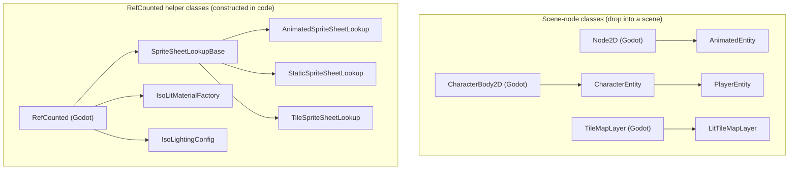

# Pixel Core

A Godot addon providing core features for **isometric pre-rendered pixel art games**: sprite-sheet layouts, lookup, entity display, characters, player control, and optional **engine 2D–lit** sprites (diffuse + normal maps from optional per-pass PNGs under each action folder).

## Architecture: body vs presentation

Keep **two concerns separate**:

1. **World role (body)** — How the thing exists in the level: `CharacterBody2D` for moving characters, `StaticBody2D` for impassible props, `Area2D` / `RigidBody2D` for pickups or moving effects, or a plain `Node2D` when you only need a visual.
2. **Presentation (presenter)** — How the pixel art is driven: sprite-sheet lookup, `frame_rate`, action/direction, frame advance, and optional lit diffuse + normal maps via Godot’s **built-in 2D lighting**.

The addon’s presenter is implemented as a **`Node2D` script with a child `Sprite2D`** (see `AnimatedEntity`). That lets the **same presenter** sit under different parents—character, static bush, floating loot—without duplicating animation or lighting code. **Extending `Sprite2D` is not required** for this pattern.

**Tiles (`TileMapLayer`)** are for grid-painted map data; they are **not** part of the character inheritance chain. For props that need **per-instance** lighting and animation (e.g. a lit torch or bush), prefer a **small scene** (body + presenter). For **lit terrain tiles**, use **`LitTileMapLayer`** and the on-disk layout in [Tile sets and lit TileMapLayer](#tile-sets-and-lit-tilemaplayer) below.

## Class overview

Every `class_name`-registered script in the addon, grouped by how you use it: **scene-node classes** are dropped under a parent in a scene, and **`RefCounted` helper classes** are constructed from code. Only the immediate Godot base is shown.



In prose (for viewers that don't render Mermaid):

- **Scene-node classes**: `AnimatedEntity` extends Godot's `Node2D`; `CharacterEntity` extends `CharacterBody2D`; `PlayerEntity` extends `CharacterEntity`; `LitTileMapLayer` extends `TileMapLayer`.
- **`RefCounted` helpers**: `SpriteSheetLookupBase` extends `RefCounted`, and `AnimatedSpriteSheetLookup`, `StaticSpriteSheetLookup`, and `TileSpriteSheetLookup` all extend `SpriteSheetLookupBase`. `IsoLitMaterialFactory` and `IsoLightingConfig` extend `RefCounted` directly.

**Composition, not inheritance.** `CharacterEntity` (and therefore `PlayerEntity`) **contains** a child `AnimatedEntity` in its scene — that's composition, and is intentionally **not** drawn as an arrow in the chart above. See the [Architecture: body vs presentation](#architecture-body-vs-presentation) section for why body and presenter are kept separate.

**Legacy bundle.** The old `lighting/legacy/` pseudo-lighting bundle (unshaded `sprite_lit.gdshader` plus a `SpriteLighting` autoload fanning uniforms out to every material each frame) has been removed. Project-wide values are **global shader parameters** now, so nothing needs to push them per frame.

## Features

- **Sprite sheet lookup** — `SpriteSheetLookupBase`, `AnimatedSpriteSheetLookup`, `StaticSpriteSheetLookup`, and **`TileSpriteSheetLookup`** (per-pass tile atlases under `tile_sheet_root`) for loading and caching texture regions from layout conventions
- **Animated entity (presenter)** — Base for sprite-sheet display with action, direction, and frame advance; export **`entity_name`** for the sprite set folder under `res://sprite/animated/` (if empty, the presenter node’s name is used). Export **`use_2d_normal_lighting`** so the child **`Sprite2D`** gets the **`iso_lit.gdshader`** material: whole pass sheets are bound **once per action** and the current cell is picked by a region uniform, so nothing is baked per frame. **Nearest** filtering, and it **receives** scene **`DirectionalLight2D` / `PointLight2D`**
- **Editor viewport preview** — In the editor, the presenter shows a **static diffuse-only** placeholder (tries **`idle`**, else first valid action in **A→Z** order; cell **S**, frame **0**). If sheet files change **on disk** but **`entity_name`** is unchanged, the preview may not update until you nudge **`entity_name`** or reload the scene.
- **Engine 2D lighting** — No autoload: add light nodes to your scene (and optional **`CanvasModulate`** for overall ambient tone). See **`test/test_scene.tscn`** for a minimal setup
- **Character entity** — Moving, collidable entities with gameplay attributes; delegates display to animated entity; re-exports **`entity_name`** on the body so you set the sprite set id next to health and speed
- **Player entity** — Player-controlled character that reads input and drives movement, action, and direction
- **Character scenes** — `player_entity.tscn` is the canonical player; enable **`use_2d_normal_lighting`** on the child presenter when you want normal-mapped 2D lighting. Optional preset: `entity/characters/player.tscn` instances the same player scene with tuned collision and sprite offsets. For a static collider + presenter demo, see **`test/static_lit_prop.tscn`**
- **Lit tile maps** — **`LitTileMapLayer`** extends **`TileMapLayer`** with **`use_2d_normal_lighting`**: the same **`iso_lit.gdshader`** as sprites, reading pass atlases beside **`diffuse.png`**, with world-up fallbacks when a pass is missing. See **`main.tscn`** in this repo and **`test/art/tile/`** for a sample set

## Animated sheet layout (per-pass files)

Under **`{animated_sheet_root}/{entity}/{action}/`**, use optional PNGs:

| File | Role |
|------|------|
| **`diffuse.png`** | Required for a valid animated action. **8 direction rows** (S, SE, E, NE, N, NW, W, SW — top to bottom) × **N columns** (frames). Frame count and cell size are taken from this file. |
| **`normal.png`** | Optional; same grid. **World-space** normal, RGB in `[0,1]` → `[-1,1]`. If missing, sprites fall back to a camera-facing normal and tile layers to world up. |
| **`height.png`** | Optional; same grid. **R channel = height above the ground plane, 1 step = 1 pixel.** This is what makes lights orbit objects instead of sliding up and down them. If missing, everything is treated as lying flat on the ground. |
| **`specular.png`** | Optional; same grid. **R channel = grayscale highlight intensity.** Tightness is the project-wide `iso_specular_shininess`. |
| **`emissive.png`** | Optional; same grid. RGB is the **literal on-screen colour**: emissive pixels take no light and ignore ambient, so black means "not emissive". |
| **`occlusion.png`** | Optional; same grid. R channel multiplies **ambient only**, which is what ambient occlusion is for. |

Resolve regions with `AnimatedSpriteSheetLookup.get_texture(entity, action, direction, frame, SpriteSheetPass.DIFFUSE)` (or `SpriteSheetPass.NORMAL`, etc.).

### Optional action transition folders (`{from}-{to}`)

To smooth logical action changes (e.g. idle → walk), you may add an **optional** bridge folder named **`{previous}-{target}`** under the entity (e.g. `idle-walk/`). Same per-pass layout as any other action (`diffuse.png`, optional `normal.png`, etc.).

- **Discovery is automatic** — when gameplay calls `set_action("walk")` from `idle`, the presenter looks up `idle-walk`; if `get_frame_count > 0`, it plays that folder **once**, then begins `walk` from frame 0.
- **Not a logical action** — do not call `set_action("idle-walk")` from gameplay; hyphenated names are presenter-internal bridges only.
- **Not `PLAY_ONCE`** — bridge clips always play through once regardless of `playback_modes`; they do not stop the timer or emit `animation_finished`. Terminal one-shot actions (e.g. death) remain `PlaybackMode.PLAY_ONCE` on the **logical** action name.
- **Missing folder** — if no `{from}-{to}` folder exists, the presenter switches to the target action immediately (same as before this feature).
- **Interrupt** — if `set_action` is called again while a bridge is playing, the bridge is abandoned and the new action starts immediately (no `{partial_bridge}-{new}` lookup).

**Normal encoding**: **world space**, **Z up**, unit length, **linearly encoded** (no sRGB transfer — normals are data, not colour). RGB in **[0,1]** maps to **[-1,1]**.

This is deliberately *not* Godot's stock 2D normal convention, and the shader writes **`NORMAL`** directly rather than **`NORMAL_MAP`** because of it. The stock path flips green and rebuilds `z = sqrt(max(0, 1 - dot(xy, xy)))`, which misreads world-space data and clamps away the back-facing normals rim lighting depends on.

The payoff: world space is camera-independent, so **camera angle is a runtime knob rather than a re-render**. `IsoLightingConfig.set_camera(yaw, elevation)` re-lights every existing sheet.

**Import settings matter** for `normal.png` and `height.png` — both carry data, not pictures:

| Setting | Required | Why |
|---|---|---|
| `compress/mode` | Lossless | Lossy or VRAM compression destroys normals and heights. |
| `detect_3d/compress_to` | Disabled | Otherwise touching the texture from 3D silently re-imports it VRAM-compressed and ruins it with no visible cause. |
| `mipmaps/generate` | Off | Averaged normals and heights are meaningless. |
| `process/premult_alpha` | Off | Would multiply the data by alpha. |

Sampling is **nearest** so normals never interpolate across a silhouette edge.

In **debug** builds, if an optional pass exists but its image size does not match `diffuse.png`, a warning is printed.

**Static sheets**: half-diffuse / half-normal in one file for **static** lookups is **not** implemented; use the animated per-pass layout for lit animated sprites.

## Tile sets and lit TileMapLayer

Tile art uses the **same pass filenames** as animated actions (`diffuse.png`, `normal.png`, `specular.png`, `occlusion.png`) but under a **separate root**—no eight-direction rows, only a **uniform grid** on each image.

### On-disk layout

- Default root: **`tile_sheet_root`** on `SpriteSheetLookupBase` is **`res://art/tile/`** (override per instance, e.g. **`res://test/art/tile/`** in tests).
- Per set: **`{tile_sheet_root}/{tile_set_id}/diffuse.png`** (required for a valid grid), plus optional passes in the same folder. Paths are **`{tile_sheet_root}/{tile_set_id}/{pass}.png`** (same names as `animated_pass_texture_path`).

### `TileSet` authoring

- Point each **`TileSetAtlasSource`** texture at the tile set’s **`diffuse.png`** (or an equivalent atlas with the **same pixel size and cell grid** as on disk).
- Set **`texture_region_size`** to the **cell size in pixels** (width × height of one tile in the sheet). It must match the grid implied by the diffuse image (exact divisibility of the texture size).

### Programmatic lookup (no `TileMap` required)

- Use **`TileSpriteSheetLookup`**: **`get_texture(tile_set_id, row, col, cell_size, sheet_pass)`** and **`get_texture_by_index(...)`**. Pass **`columns <= 0`** on the index API to derive column count from diffuse width ÷ **`cell_size.x`**.
- If **`diffuse.png`** is missing, **`cell_size`** does not divide the diffuse dimensions evenly, an optional pass file is missing, or indices are out of range, the methods return an **empty `AtlasTexture`** (no atlas assigned)—they do **not** throw. In **debug** builds, a **warning** is emitted when an optional pass exists but its size does not match diffuse (same idea as animated lookup).

### Lit tiles (engine 2D lighting)

1. Use a **`LitTileMapLayer`** (script: **`tile_map/lit_tile_map_layer.gd`**) instead of a plain **`TileMapLayer`**, or attach that script to your layer node.
2. Enable **`use_2d_normal_lighting`**. The layer gets a **`ShaderMaterial`** from **`IsoLitMaterialFactory`** (shader **`lighting/iso_lit.gdshader`** — the same one sprites use): **diffuse** comes from Godot's tile draw path (**`TEXTURE` / `UV`**); the other passes come from **full atlas** uniforms with the **same UVs**, so each painted cell picks matching texels.
3. **`texture_filter`** is set to **nearest** while lit mode is on.
4. **`tile_set_id`**: if empty at runtime, the addon takes the **parent directory name** of the first **`TileSetAtlasSource`** texture's **`resource_path`** (e.g. `res://art/tile/paver/diffuse.png` → **`paver`**). A **`CanvasTexture`** wrapper is unwrapped to the diffuse it carries. You can set **`tile_set_id`** explicitly instead.
5. **`tile_sheet_root_override`**: when non-empty and you are not passing a custom **`tile_sheet_lookup`**, this string replaces the default **`res://art/tile/`** when resolving pass files.
6. **`normal_map_texture_path`**: optional explicit **`res://`** path to the normal atlas; when set and the file exists, it overrides **`{tile_sheet_root}/{tile_set_id}/normal.png`**.
7. Missing passes bind **1×1 fallbacks**, so lighting still runs. A tile layer's fallback normal is **world up**, which is the correct normal for a floor.

Add the same **`DirectionalLight2D` / `PointLight2D`** as for characters. A minimal demo lives in **`main.tscn`**.

## Engine 2D lighting setup (default lit path)

1. On **`AnimatedEntity`**, enable **`use_2d_normal_lighting`**. The presenter assigns the **`iso_lit.gdshader`** material, binds the action's pass sheets once, and writes only the cell region per frame.
2. Add **`DirectionalLight2D`** and/or **`PointLight2D`** under the same **`CanvasLayer`** / world as the sprite.
3. Set ambient with **`IsoLightingConfig.set_ambient(color, energy)`** — **not** a **`CanvasModulate`** (see below).
4. Keep project **canvas texture filter** = **nearest** for pixel art (`textures/canvas_textures/default_texture_filter`); the presenter forces nearest on the child sprite while lit mode is on.
5. For **tile layers**, follow [Lit tiles](#lit-tiles-engine-2d-lighting) above.

### Placing lights

> Put a light node at the screen position of the point **directly below it on the ground**, and set **`height`** to its height above that ground, **in pixels**.

This **redefines Godot's `height`** from "out of the screen" to "world up", and it is what lets `LIGHT_POSITION` be read as a real 3D position. Existing scenes' lights will mean something different after this change — re-place them.

For a **`DirectionalLight2D`**, rotating the node swings the sun around the vertical axis and **`height`** sets its elevation: rotation **90°** lights screen-right-facing surfaces, **270°** screen-left.

Under the hood the shader gives each pixel its true ground position and height via **`LIGHT_VERTEX`**, so a light genuinely orbits an object instead of sliding up and down it. `test/iso_lighting_probe.tscn` is the one-minute check: orbit a light and watch whether the terminator sweeps sideways (working) or slides vertically (broken).

### Ground shadows

Cast from the **`shadow_map.png`** pass (**R** = bottom, **G** = top of the geometry above each ground
point, both at one step per pixel; **A** = coverage). Add an **`IsoGroundShadow`** under the body,
point **`presenter`** at the `AnimatedEntity`, and give it a **`z_index`** below the entities.

The quad lies on the ground and is drawn with **`blend_sub`**, with occlusion computed inside
**`light()`**. That means each light subtracts exactly the light it would have delivered, so culling,
masks, colour and energy all come from the light node — and a warm torch's shadow leaves the cool
ambient behind instead of painting flat grey.

Nothing about the shape is authored. For each ground pixel the shader marches back toward the light
and tests whether the caster's vertical extent intersects the ray, so **length and direction follow
the light's ground position and height on their own**: lower the light and the ray to it gets
shallower, staying inside the caster over a longer distance. Softness comes from treating the light
as a disc and averaging several rays — near the contact point every ray passes through nearly the
same place, so the edge stays crisp and spreads with distance.

Measured by `test/iso_shadow_probe.tscn` against an analytically known caster (40 px tall, light
150 px away): tip at 110 px for a light 100 px up and 175 px for one 80 px up, both inside the band
the geometry predicts; penumbra 9 px at contact widening to 61 px far out.

| Global | Role |
|---|---|
| `iso_shadow_strength` | Overall darkness. |
| `iso_shadow_softness` | Light disc radius in screen px. `0` gives hard shadows; larger widens the penumbra with distance while leaving contact crisp. |
| `iso_shadow_max_length` | How far a shadow is traced, in screen px. |

**`field_extent`** (on the node) is how many caster cells wide the quad is, and it caps how far a
shadow can reach: the height field only covers one cell, so beyond that there is no data and the
shadow is clipped. The default of `3` handles ordinary lights; very low lights need a larger value,
which costs fill rate. In the probe, a light 60 px up clipped at 191 px with `field_extent = 3` and
reached its full 329 px at `7`.

**Cost:** 8 rays x 24 steps, so up to 192 texture fetches per shadowed pixel per light. That is the
main reason to keep the quad only as large as the shadows actually need.

### Project-wide knobs (global shader parameters)

Registered in **Project Settings → Shader Globals**, and settable at runtime through **`IsoLightingConfig`** without re-rendering any art. `IsoLightingConfig.ensure_globals()` registers any that are missing, which consumers of this addon need on first run.

| Global | Role |
|---|---|
| `iso_ambient_color` / `iso_ambient_energy` | Ambient level. Replaces `CanvasModulate`, which cannot be used here because it would multiply **emissive** too and stop it being the literal screen colour. |
| `iso_yaw_rot`, `iso_cos_elevation`, `iso_sin_elevation` | Camera basis. Set together via **`IsoLightingConfig.set_camera(yaw_degrees, elevation_degrees)`**; defaults are **45° yaw, 30° elevation**, measured from the bundled art. |
| `iso_terminator_low` / `iso_terminator_high` | The harsh terminator band. Narrow = hard wrap for dark, torch-lit scenes; widen to soften. |
| `iso_terminator_form` | How much `N·L` shaping survives **above** the terminator. `0` gives a flat, toon-shaded lit side with no form in it; the default `0.75` keeps the hard wrap while still revealing shape. |
| `iso_rim_power` / `iso_rim_strength` | Fresnel rim. Needs **no authored mask** — with the light behind, the pixels facing it are the ones facing away from the camera, so fresnel and `N·L` peak together at the silhouette. Keep the power low so the rim reaches inward; the true silhouette is only 1–2 px. |
| `iso_specular_shininess` / `iso_specular_strength` | Highlight tightness and scale, against `specular.png`. |
| `iso_height_falloff` | `1` = on. Dims by the light's **height**, which Godot's own falloff ignores entirely. |
| `iso_height_falloff_scale` | Height in px at which that dimming reaches half. |

**Known limitation — falloff is screen-space.** `LIGHT_COLOR` arrives with the light's texture already multiplied in, sampled at the light's *screen* position. Measured consequence: raising a light from 20 px to 200 px above a surface changed its brightness **not at all**. Direction is fully 3D; Godot's own falloff is not. `iso_height_falloff` exists to cover that and is **on by default**, because a torch-lit scene reads wrong without it. Ground-distance falloff still comes from the light's texture, so its gradient is what shapes the near/far response. Doing all of it properly would need a per-light range, which Godot does not expose to canvas shaders.

**`LIGHT_ENERGY` must be applied explicitly.** `LIGHT_COLOR` carries the light's colour and its texture falloff but *not* its energy — sweeping energy from 0.5 to 4.0 moved the result not at all until the shader multiplied it in. `test/iso_light_response_probe.tscn` pins this, along with the terminator transfer curve and the height falloff.

**Rendering:** This addon targets **Godot 4.x** with **GL Compatibility**; `LIGHT_VERTEX`, `NORMAL` and a custom `light()` all work there. Verify in your target configuration.

## Usage

**Rename:** The presenter export was **`entity_id`**; it is now **`entity_name`**. Update any scripts or scenes that referenced `entity_id`.

Add this addon to your Godot project, then:

1. Use `CharacterEntity` or `PlayerEntity` as a base for characters. Set **`entity_name`** on the character root to the folder name under `res://sprite/animated/<entity_name>/<action>/diffuse.png` (same as the child presenter’s `entity_name`).
2. Use **`AnimatedEntity`** for sprite-sheet display; set **`use_2d_normal_lighting`** when you want engine 2D normal-mapped lighting. For props without a character body, instance `animated_entity.tscn` (or the same script on a `Node2D` + `Sprite2D` tree) and set **`entity_name`**.
3. Place **`DirectionalLight2D` / `PointLight2D`** (and optional **`CanvasModulate`**) in your level scenes.
4. Use the sprite sheet lookup classes to load textures and resolve regions by layout rules

All classes use `class_name`, so they are available globally once the addon is in your project.

### Migration (entity refactor)

- Previously **`LitAnimatedEntity`** (its own subclass); now configure **`use_2d_normal_lighting`** on **`AnimatedEntity`** for engine 2D lighting, or opt into the **legacy** bundle (see above) for the old shader path.
- Previously **`player_entity_lit.tscn`** (a separate lit player scene); now instance **`player_entity.tscn`** and enable **`use_2d_normal_lighting`** on its **`AnimatedEntity`** child (see **`test/test_scene.gd`** / scene lights in **`test/test_scene.tscn`**).
- Previously **`entity/characters/character.gd`** and **`character.tscn`** (a parallel character implementation); now use **`CharacterEntity`** / **`PlayerEntity`** plus the shared presenter, with **`entity/characters/player.tscn`** as a preset that instances **`player_entity.tscn`**.
- The `class_name` **`AnimatedEntity`** is retained — a rename (e.g. `SpriteSheetPresenter`) would be **breaking**; deferred until a dedicated release note.

### Migration (iso lit shader)

- **`tile_lit.gdshader`**, **`tile_lit_material.tres`** and **`TileLitMaterialFactory`** are replaced by **`iso_lit.gdshader`** + **`IsoLitMaterialFactory`**, shared by sprites and tile layers. The **`normal_y_flip`** uniform is gone — it solved a problem world-space normals do not have.
- Normal maps are now **world space**, not tangent/screen space. Sheets baked for the old convention will light incorrectly and need re-baking.
- New optional passes: **`height.png`** and **`emissive.png`** (see the layout table). `SpriteSheetPass` gained `HEIGHT` and `EMISSIVE`, appended so existing values keep their meaning.
- **Remove `CanvasModulate`** from lit scenes and use **`IsoLightingConfig.set_ambient()`**; `CanvasModulate` would also multiply emissive.
- **Re-place your lights**: `height` now means height above the ground in pixels, and a light node belongs at the ground point below the light.
- The per-cell `ImageTexture` bake and its static cache in `AnimatedEntity` are gone; the shader reads whole sheets with a region uniform instead.

### Migration (lighting refactor)

- **`use_pseudo_lighting`** → **`use_2d_normal_lighting`** (engine 2D lights; no **`SpriteLighting`** autoload by default).
- The old shader and autoload have been removed; see the lighting sections above.

## Adding as a submodule

This addon is intended to be consumed via git submodule. Because git submodules target a whole repo (not a subfolder), use a **staging location + symlink** pattern:

### 1. Add the submodule (staging path)

```bash
git submodule add <repo-url> .addons-src/godot-pixel-core
```

### 2. Symlink or copy the addon folder

**Linux / macOS:**

```bash
ln -s ../../.addons-src/godot-pixel-core/addons/godot-pixel-core addons/godot-pixel-core
```

**Windows (run Command Prompt or PowerShell as Administrator):**

```cmd
mklink /D addons\godot-pixel-core .addons-src\godot-pixel-core\addons\godot-pixel-core
```

> **Note:** `mklink /D` requires Developer Mode on Windows 10/11, or run as Administrator.

**Alternative — direct copy:**

If you prefer not to use symlinks, copy the `addons/godot-pixel-core/` folder from this repo into your project's `addons/` directory. Re-copy when you update the submodule.
