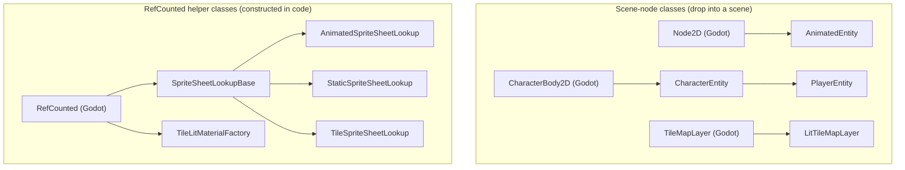

# Pixel Core

A Godot addon providing core features for **isometric pre-rendered pixel art games**: sprite-sheet layouts, lookup, entity display, characters, player control, and optional **engine 2D–lit** sprites (diffuse + normal maps from optional per-pass PNGs under each action folder).

## Architecture: body vs presentation

Keep **two concerns separate**:

1. **World role (body)** — How the thing exists in the level: `CharacterBody2D` for moving characters, `StaticBody2D` for impassible props, `Area2D` / `RigidBody2D` for pickups or moving effects, or a plain `Node2D` when you only need a visual.
2. **Presentation (presenter)** — How the pixel art is driven: sprite-sheet lookup, `frame_rate`, action/direction, frame advance, and optional lit diffuse + normal maps via Godot’s **built-in 2D lighting**.

The addon’s presenter is implemented as a **`Node2D` script with a child `Sprite2D`** (see `AnimatedEntity`). That lets the **same presenter** sit under different parents—character, static bush, floating loot—without duplicating animation or lighting code. **Extending `Sprite2D` is not required** for this pattern.

**Tiles (`TileMapLayer`)** are for grid-painted map data; they are **not** part of the character inheritance chain. For props that need **per-instance** lighting and animation (e.g. a lit torch or bush), prefer a **small scene** (body + presenter). For **lit terrain tiles**, use **`LitTileMapLayer`** and the on-disk layout in [Tile sets and lit TileMapLayer](#tile-sets-and-lit-tilemaplayer) below.

## Class overview

Every `class_name`-registered script in the addon, grouped by how you use it: **scene-node classes** are dropped under a parent in a scene, and **`RefCounted` helper classes** are constructed from code. Only the immediate Godot base is shown.



In prose (for viewers that don't render Mermaid):

- **Scene-node classes**: `AnimatedEntity` extends Godot's `Node2D`; `CharacterEntity` extends `CharacterBody2D`; `PlayerEntity` extends `CharacterEntity`; `LitTileMapLayer` extends `TileMapLayer`.
- **`RefCounted` helpers**: `SpriteSheetLookupBase` extends `RefCounted`, and `AnimatedSpriteSheetLookup`, `StaticSpriteSheetLookup`, and `TileSpriteSheetLookup` all extend `SpriteSheetLookupBase`. `TileLitMaterialFactory` extends `RefCounted` directly.

**Composition, not inheritance.** `CharacterEntity` (and therefore `PlayerEntity`) **contains** a child `AnimatedEntity` in its scene — that's composition, and is intentionally **not** drawn as an arrow in the chart above. See the [Architecture: body vs presentation](#architecture-body-vs-presentation) section for why body and presenter are kept separate.

**Legacy bundle.** `addons/godot-pixel-core/lighting/legacy/sprite_lighting.gd` extends `Node`, has **no `class_name`**, and loads only when a project manually autoloads it. It is intentionally outside this chart; see [Legacy pseudo-lighting (`lighting/legacy/`)](#legacy-pseudo-lighting-lightinglegacy) below.

## Features

- **Sprite sheet lookup** — `SpriteSheetLookupBase`, `AnimatedSpriteSheetLookup`, `StaticSpriteSheetLookup`, and **`TileSpriteSheetLookup`** (per-pass tile atlases under `tile_sheet_root`) for loading and caching texture regions from layout conventions
- **Animated entity (presenter)** — Base for sprite-sheet display with action, direction, and frame advance; export **`entity_name`** for the sprite set folder under `res://sprite/animated/` (if empty, the presenter node’s name is used). Export **`use_2d_normal_lighting`** so the child **`Sprite2D.texture`** is a **`CanvasTexture`** (diffuse + normal slots filled from **`diffuse.png` / `normal.png`** each **`update_sprite`**, cells baked to **`ImageTexture`** for engine compatibility), **nearest** filtering, and a **`CanvasItemMaterial`** that **receives** scene **`DirectionalLight2D` / `PointLight2D`**
- **Editor viewport preview** — In the editor, the presenter shows a **static diffuse-only** placeholder (tries **`idle`**, else first valid action in **A→Z** order; cell **S**, frame **0**). If sheet files change **on disk** but **`entity_name`** is unchanged, the preview may not update until you nudge **`entity_name`** or reload the scene.
- **Engine 2D lighting** — No autoload: add light nodes to your scene (and optional **`CanvasModulate`** for overall ambient tone). See **`test/test_scene.tscn`** for a minimal setup
- **Character entity** — Moving, collidable entities with gameplay attributes; delegates display to animated entity; re-exports **`entity_name`** on the body so you set the sprite set id next to health and speed
- **Player entity** — Player-controlled character that reads input and drives movement, action, and direction
- **Character scenes** — `player_entity.tscn` is the canonical player; enable **`use_2d_normal_lighting`** on the child presenter when you want normal-mapped 2D lighting. Optional preset: `entity/characters/player.tscn` instances the same player scene with tuned collision and sprite offsets. For a static collider + presenter demo, see **`test/static_lit_prop.tscn`**
- **Lit tile maps** — **`LitTileMapLayer`** extends **`TileMapLayer`** with **`use_2d_normal_lighting`**: dual-atlas shader (`lighting/tile_lit.gdshader`), **`normal.png`** beside **`diffuse.png`**, flat normal if the normal atlas is missing. See **`main.tscn`** in this repo and **`test/art/tile/`** for a sample set

## Animated sheet layout (per-pass files)

Under **`{animated_sheet_root}/{entity}/{action}/`**, use optional PNGs:

| File | Role |
|------|------|
| **`diffuse.png`** | Required for a valid animated action. **8 direction rows** (S, SE, E, NE, N, NW, W, SW — top to bottom) × **N columns** (frames). Frame count and cell size are taken from this file. |
| **`normal.png`** | Optional; same grid as diffuse. Used with engine 2D lighting (`CanvasTexture` normal slot). If missing, lit mode uses a flat normal. |
| **`specular.png`** | Optional; same grid. Loaded and cached when present for future/custom shading (not assigned to stock `CanvasTexture` in the default lit path). |
| **`occlusion.png`** | Optional; same grid. Same as specular for future use. |

Resolve regions with `AnimatedSpriteSheetLookup.get_texture(entity, action, direction, frame, SpriteSheetPass.DIFFUSE)` (or `SpriteSheetPass.NORMAL`, etc.).

### Optional action transition folders (`{from}-{to}`)

To smooth logical action changes (e.g. idle → walk), you may add an **optional** bridge folder named **`{previous}-{target}`** under the entity (e.g. `idle-walk/`). Same per-pass layout as any other action (`diffuse.png`, optional `normal.png`, etc.).

- **Discovery is automatic** — when gameplay calls `set_action("walk")` from `idle`, the presenter looks up `idle-walk`; if `get_frame_count > 0`, it plays that folder **once**, then begins `walk` from frame 0.
- **Not a logical action** — do not call `set_action("idle-walk")` from gameplay; hyphenated names are presenter-internal bridges only.
- **Not `PLAY_ONCE`** — bridge clips always play through once regardless of `playback_modes`; they do not stop the timer or emit `animation_finished`. Terminal one-shot actions (e.g. death) remain `PlaybackMode.PLAY_ONCE` on the **logical** action name.
- **Missing folder** — if no `{from}-{to}` folder exists, the presenter switches to the target action immediately (same as before this feature).
- **Interrupt** — if `set_action` is called again while a bridge is playing, the bridge is abandoned and the new action starts immediately (no `{partial_bridge}-{new}` lookup).

**Normal encoding** (for engine 2D lighting and for the **legacy** shader): tangent-style RGB in **[0,1]**, mapped to **[-1,1]** with fixed basis **+X right, +Y up, +Z out of the sprite plane** (toward the viewer). Match Godot’s expected normal map orientation for the **`CanvasTexture`** normal slot. If you use the **legacy** bundle and your art’s green channel is inverted, set **`normal_y_flip`** to **-1** on the duplicated **`lighting/legacy/sprite_lit_material.tres`**.

In **debug** builds, if an optional pass exists but its image size does not match `diffuse.png`, a warning is printed.

**Static sheets**: half-diffuse / half-normal in one file for **static** lookups is **not** implemented; use the animated per-pass layout for lit animated sprites.

## Tile sets and lit TileMapLayer

Tile art uses the **same pass filenames** as animated actions (`diffuse.png`, `normal.png`, `specular.png`, `occlusion.png`) but under a **separate root**—no eight-direction rows, only a **uniform grid** on each image.

### On-disk layout

- Default root: **`tile_sheet_root`** on `SpriteSheetLookupBase` is **`res://art/tile/`** (override per instance, e.g. **`res://test/art/tile/`** in tests).
- Per set: **`{tile_sheet_root}/{tile_set_id}/diffuse.png`** (required for a valid grid), plus optional passes in the same folder. Paths are **`{tile_sheet_root}/{tile_set_id}/{pass}.png`** (same names as `animated_pass_texture_path`).

### `TileSet` authoring

- Point each **`TileSetAtlasSource`** texture at the tile set’s **`diffuse.png`** (or an equivalent atlas with the **same pixel size and cell grid** as on disk).
- Set **`texture_region_size`** to the **cell size in pixels** (width × height of one tile in the sheet). It must match the grid implied by the diffuse image (exact divisibility of the texture size).

### Programmatic lookup (no `TileMap` required)

- Use **`TileSpriteSheetLookup`**: **`get_texture(tile_set_id, row, col, cell_size, sheet_pass)`** and **`get_texture_by_index(...)`**. Pass **`columns <= 0`** on the index API to derive column count from diffuse width ÷ **`cell_size.x`**.
- If **`diffuse.png`** is missing, **`cell_size`** does not divide the diffuse dimensions evenly, an optional pass file is missing, or indices are out of range, the methods return an **empty `AtlasTexture`** (no atlas assigned)—they do **not** throw. In **debug** builds, a **warning** is emitted when an optional pass exists but its size does not match diffuse (same idea as animated lookup).

### Lit tiles (engine 2D lighting)

1. Use a **`LitTileMapLayer`** (script: **`tile_map/lit_tile_map_layer.gd`**) instead of a plain **`TileMapLayer`**, or attach that script to your layer node.
2. Enable **`use_2d_normal_lighting`**. The layer gets a **`ShaderMaterial`** from **`TileLitMaterialFactory`** (preset **`lighting/tile_lit_material.tres`**, shader **`lighting/tile_lit.gdshader`**): **diffuse** comes from Godot’s tile draw path (**`TEXTURE` / `UV`**); **normals** come from a **second full atlas** uniform with the **same UVs**, so each painted cell picks matching texels from **`normal.png`**.
3. **`texture_filter`** is set to **nearest** while lit mode is on.
4. **`tile_set_id`**: if empty at runtime, the addon takes the **parent directory name** of the first **`TileSetAtlasSource`** texture’s **`resource_path`** (e.g. `res://art/tile/paver/diffuse.png` → **`paver`**). You can set **`tile_set_id`** explicitly instead.
5. **`tile_sheet_root_override`**: when non-empty and you are not passing a custom **`tile_sheet_lookup`**, this string replaces the default **`res://art/tile/`** when resolving **`normal.png`**.
6. **`normal_map_texture_path`**: optional explicit **`res://`** path to the normal atlas; when set and the file exists, it overrides **`{tile_sheet_root}/{tile_set_id}/normal.png`**.
7. If **`normal.png`** (and override) is absent, **`TileLitMaterialFactory`** binds a **1×1 flat normal** (same spirit as lit sprites without a normal pass) so lighting still runs.

Add the same **`DirectionalLight2D` / `PointLight2D`** (and optional **`CanvasModulate`**) as for characters. A minimal demo lives in **`main.tscn`** (lit layer + **`test/art/tile/paver/`** with **`diffuse.png`** / **`normal.png`**).

## Engine 2D lighting setup (default lit path)

1. On **`AnimatedEntity`**, enable **`use_2d_normal_lighting`**. The presenter sets **`Sprite2D.texture`** to a **`CanvasTexture`** whose diffuse and normal slots match the current lookup cell every **`update_sprite`**, with **nearest** filtering on the bundle.
2. Add **`DirectionalLight2D`** and/or **`PointLight2D`** (and other supported 2D lights) under the same **`CanvasLayer`** / world as the sprite so they affect the presenter.
3. Tune overall brightness with **`CanvasModulate`** (or environment / project defaults) so normals read clearly—fully white modulate can look flat.
4. Keep project **canvas texture filter** = **nearest** for pixel art (`textures/canvas_textures/default_texture_filter` in project settings); the presenter forces nearest on the child sprite while lit mode is on.
5. For **tile layers**, follow [Tile sets and lit TileMapLayer](#tile-sets-and-lit-tilemaplayer): enable **`use_2d_normal_lighting`** on **`LitTileMapLayer`** and align normal atlases with diffuse.

**Rendering:** This addon targets **Godot 4.x** with **GL Compatibility** where relevant; behavior of normals + lights can vary slightly by renderer—verify in your target configuration.

## Legacy pseudo-lighting (`lighting/legacy/`)

The previous approach—custom **`sprite_lit.gdshader`** in **unshaded** mode, duplicated **`sprite_lit_material.tres`**, and optional **`sprite_lighting.gd`** pushing per-material uniforms each frame—is **kept under** **`addons/godot-pixel-core/lighting/legacy/`** for reference and manual rollback only.

- **Not autoloaded** in the stock demo project.
- To experiment with it: duplicate **`lighting/legacy/sprite_lit_material.tres`**, assign to a **`Sprite2D`**, add **`lighting/legacy/sprite_lighting.gd`** as an autoload yourself, and call **`register_lit_material`** / **`unregister_lit_material`** as before.
- **API (when used manually):** `SpriteLighting` (your autoload name) exposes **`ambient_color`**, **`directional_direction`** (normalized **toward** the light, canvas **XY**), **`directional_color`**, **`directional_intensity`**, and point helpers **`set_point_light`**, **`add_point_light`**, **`clear_point_lights`** (max **4** point lights for GL Compatibility). See comments in **`lighting/legacy/sprite_lighting.gd`** and **`lighting/legacy/sprite_lit.gdshader`**.

## Usage

**Rename:** The presenter export was **`entity_id`**; it is now **`entity_name`**. Update any scripts or scenes that referenced `entity_id`.

Add this addon to your Godot project, then:

1. Use `CharacterEntity` or `PlayerEntity` as a base for characters. Set **`entity_name`** on the character root to the folder name under `res://sprite/animated/<entity_name>/<action>/diffuse.png` (same as the child presenter’s `entity_name`).
2. Use **`AnimatedEntity`** for sprite-sheet display; set **`use_2d_normal_lighting`** when you want engine 2D normal-mapped lighting. For props without a character body, instance `animated_entity.tscn` (or the same script on a `Node2D` + `Sprite2D` tree) and set **`entity_name`**.
3. Place **`DirectionalLight2D` / `PointLight2D`** (and optional **`CanvasModulate`**) in your level scenes.
4. Use the sprite sheet lookup classes to load textures and resolve regions by layout rules

All classes use `class_name`, so they are available globally once the addon is in your project.

### Migration (entity refactor)

- Previously **`LitAnimatedEntity`** (its own subclass); now configure **`use_2d_normal_lighting`** on **`AnimatedEntity`** for engine 2D lighting, or opt into the **legacy** bundle (see above) for the old shader path.
- Previously **`player_entity_lit.tscn`** (a separate lit player scene); now instance **`player_entity.tscn`** and enable **`use_2d_normal_lighting`** on its **`AnimatedEntity`** child (see **`test/test_scene.gd`** / scene lights in **`test/test_scene.tscn`**).
- Previously **`entity/characters/character.gd`** and **`character.tscn`** (a parallel character implementation); now use **`CharacterEntity`** / **`PlayerEntity`** plus the shared presenter, with **`entity/characters/player.tscn`** as a preset that instances **`player_entity.tscn`**.
- The `class_name` **`AnimatedEntity`** is retained — a rename (e.g. `SpriteSheetPresenter`) would be **breaking**; deferred until a dedicated release note.

### Migration (lighting refactor)

- **`use_pseudo_lighting`** → **`use_2d_normal_lighting`** (engine 2D lights; no **`SpriteLighting`** autoload by default).
- Old shader + autoload live under **`lighting/legacy/`**.

## Adding as a submodule

This addon is intended to be consumed via git submodule. Because git submodules target a whole repo (not a subfolder), use a **staging location + symlink** pattern:

### 1. Add the submodule (staging path)

```bash
git submodule add <repo-url> .addons-src/godot-pixel-core
```

### 2. Symlink or copy the addon folder

**Linux / macOS:**

```bash
ln -s ../../.addons-src/godot-pixel-core/addons/godot-pixel-core addons/godot-pixel-core
```

**Windows (run Command Prompt or PowerShell as Administrator):**

```cmd
mklink /D addons\godot-pixel-core .addons-src\godot-pixel-core\addons\godot-pixel-core
```

> **Note:** `mklink /D` requires Developer Mode on Windows 10/11, or run as Administrator.

**Alternative — direct copy:**

If you prefer not to use symlinks, copy the `addons/godot-pixel-core/` folder from this repo into your project's `addons/` directory. Re-copy when you update the submodule.
