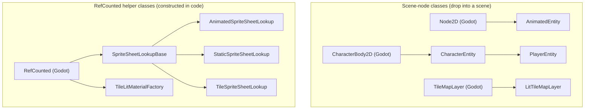

## Context

Pixel Core ships a small number of `class_name`-registered scripts. Today a new reader has to grep `extends` lines across `entity/`, `sprite_sheet/`, `tile_map/`, and `lighting/` to learn which addon class extends which Godot base. The README explains features in prose and `docs/ASSET_LIBRARY.md` has no class overview at all.

This change is already a documentation sweep (per `proposal.md`), so it is the right moment to add a one-screen picture of the inheritance tree alongside the existing layout/migration rewrites. The chart's intended home is `addons/godot-pixel-core/README.md` (per the existing `addon-structure` rule that the README is authoritative). `docs/ASSET_LIBRARY.md` links to it rather than duplicating.

The relevant post–`remove-stale-entity-bundles` set of `class_name`s in the addon is:

- **Scene-node classes** (`@tool`-friendly, instanced in a scene tree)
  - `AnimatedEntity` (extends `Node2D`)
  - `CharacterEntity` (extends `CharacterBody2D`)
  - `PlayerEntity` (extends `CharacterEntity`)
  - `LitTileMapLayer` (extends `TileMapLayer`)
- **Helper classes** (extend `RefCounted`, constructed from code)
  - `SpriteSheetLookupBase`
  - `AnimatedSpriteSheetLookup` (extends `SpriteSheetLookupBase`)
  - `StaticSpriteSheetLookup` (extends `SpriteSheetLookupBase`)
  - `TileSpriteSheetLookup` (extends `SpriteSheetLookupBase`)
  - `TileLitMaterialFactory` (extends `RefCounted`)
- **Legacy bundle** (`lighting/legacy/sprite_lighting.gd`) — `extends Node`, no `class_name`, manual autoload only; deliberately outside the canonical tree.

## Goals / Non-Goals

**Goals:**

- Add one small flow chart to `addons/godot-pixel-core/README.md` that names every `class_name`-registered script in the addon, its immediate Godot base, and groups them by purpose (scene-node tree vs. `RefCounted` helper tree).
- The chart SHALL distinguish:
  - **Scene-node classes** the user drops under a body/world.
  - **`RefCounted` helper classes** the user constructs in code.
  - The **legacy** `lighting/legacy/sprite_lighting.gd` is named in a callout under the chart — explicitly **not** drawn into the canonical tree.
- Source of truth for the chart lives in this design (so reviewers can confirm intent); the rendered location is the README.

**Non-Goals:**

- No reorganisation of the addon's class hierarchy. The chart documents what is already there post–`remove-stale-entity-bundles`.
- No UML, sequence, or composition diagram. The fact that `CharacterEntity` *contains* an `AnimatedEntity` child (composition, not inheritance) becomes a one-line callout under the chart, not its own diagram.
- Not in scope for `docs/ASSET_LIBRARY.md`. That file links to README per the existing "README is authoritative" rule in `addon-structure`.

## Decisions

### Decision 1: Mermaid `graph TD` over ASCII tree

Mermaid renders as a real diagram on GitHub, the Godot AssetLib README preview, and most Markdown previewers. The raw source is also legible in a plain editor (each line is `Base --> Child`).

Alternatives considered:

- **ASCII tree** — More universally "portable" but never renders as a picture, harder to extend when a class is added, and looks noisy when grouped.
- **Static image (PNG/SVG)** — Best fidelity, but the addon `project.md` says do not generate or change images in the repo, and binary diagrams drift silently.

Mermaid wins because the source is also the rendered form, and a `class_name` change is a one-line edit.

### Decision 2: Two subgraphs (scene-node tree, helper tree); legacy noted separately

The README's existing "body vs. presentation" framing already splits the addon into two mental models. Mirroring that split in the chart keeps the picture honest:

- **Scene nodes** (`AnimatedEntity`, `CharacterEntity`, `PlayerEntity`, `LitTileMapLayer`) — instanced under a parent.
- **Helpers** (`SpriteSheetLookupBase` family, `TileLitMaterialFactory`) — constructed in code.

Drawing them as one tree would imply that, say, `LitTileMapLayer` is in the character chain (it is not — README already warns about this). The legacy script lives outside both groups, as a one-line note under the chart, because pulling it into the tree would suggest it is part of the supported API.

### Decision 3: Chart lives in `addons/godot-pixel-core/README.md`; this design holds the canonical source

The chart's source-of-truth copy is in this design (so a reviewer can confirm intent before it lands). The rendered location is the README, in a new **"Class overview"** section placed above **"Features"** so it is the first thing a reader sees after the architecture preamble.

`docs/ASSET_LIBRARY.md` only **links** to this section. The existing `addon-structure` rule "Asset Library doc is consistent with README" already names the README as the source of truth; duplicating the chart would create two copies that can drift.

### Decision 4: Show only addon `class_name`s plus their immediate Godot base

Showing the full Godot ancestry (`Object → Node → CanvasItem → Node2D → CharacterBody2D → …`) clutters the picture without helping the reader use the addon. One Godot parent per addon class is enough to answer "what can I attach this to, and where in the inspector will I see it?".

### Reference: the chart itself

Callouts that accompany the chart in the README:

- **Composition, not inheritance**: `CharacterEntity` (and therefore `PlayerEntity`) contains a child `AnimatedEntity` in its scene; that relationship is composition and is intentionally **not** drawn as an arrow.
- **Legacy bundle**: `addons/godot-pixel-core/lighting/legacy/sprite_lighting.gd` extends `Node` and has no `class_name`. It is intentionally outside this chart and only runs when a project manually autoloads it (see "Legacy pseudo-lighting").

## Risks / Trade-offs

- **Mermaid not rendering in some Markdown viewers** → Mitigation: the raw source is legible as ASCII (`Base --> Child` lines), and the prose immediately under the chart re-states the same relationships so a non-rendering viewer still gets the information.
- **Chart drifts as classes are added or removed** → Mitigation: `tasks.md` adds an explicit verification step against `addons/godot-pixel-core/**/*.gd`, and `addon-structure` is extended with a scenario that any change to a `class_name` MUST update the chart in the same change.
- **Composition vs. inheritance confusion** (e.g. a reader thinks `CharacterEntity` *is-a* `AnimatedEntity`) → Mitigation: chart deliberately omits composition arrows; the README callout under the chart says so in one line.
- **README becomes the only place this lives** → Acceptable trade-off: `addon-structure` already names README as the authoritative doc, and the duplicated-chart alternative would invite drift between README and `docs/ASSET_LIBRARY.md`.

## Open Questions

- Whether to also surface the chart in `docs/ASSET_LIBRARY.md` (duplicated copy) for readers who land there first. Current plan: link only. Revisit if the asset-library doc grows its own audience that does not read README.
- Whether to colour-code the two subgraphs (`classDef`). Current plan: no — keep the Mermaid source minimal so the raw text reads as documentation. Revisit once the chart is in the README and we can see how it renders in the Godot editor's Markdown preview.
